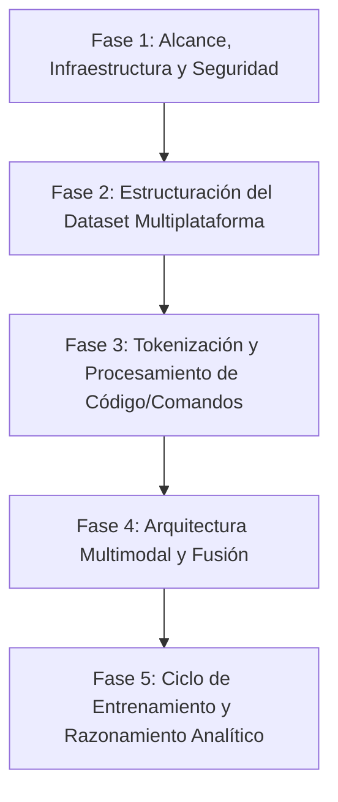

# Guía de Diseño de IA Especializada en Redes (IEEE 802), Telemática y Seguridad Multiplataforma

Esta guía detalla el diseño de un modelo de IA pequeño y especializado en **infraestructura de red, telemática y seguridad informática**, enfocado en estándares IEEE 802 (Ethernet, Wi-Fi, VLANs, etc.). El modelo está concebido para ser multiplataforma, abarcando comandos de diagnóstico y seguridad tanto para **Windows** (CMD/PowerShell) y **Linux**, como para sistemas operativos de red (**Cisco IOS, Junos, RouterOS**, etc.).

---

## 🗺️ Mapa de Ruta del Proyecto



---

## 🛡️ Fase 1: Alcance de la IA (Infraestructura, Telemática y Seguridad)

Para que tu IA tenga un conocimiento sólido, estructuraremos su dominio en tres pilares:

### 1. Infraestructura y Telemática (IEEE 802)
*   **IEEE 802.3 (Ethernet):** Diagnóstico de capa física (cableado, interfaces), negociación (Speed/Duplex), y control de flujo.
*   **IEEE 802.11 (Wi-Fi):** Canales, bandas (2.4GHz, 5GHz, 6GHz), estándares (a/b/g/n/ac/ax/be), roaming y atenuación.
*   **IEEE 802.1Q (VLANs & Trunking):** Segmentación de red, etiquetado de tramas, subinterfaces y enrutamiento inter-VLAN.
*   **IEEE 802.1D/w/s (Spanning Tree Protocol):** Evitar bucles en topologías redundantes de infraestructura.

### 2. Seguridad en la Red
*   **IEEE 802.1X (Control de Admisión/Autenticación):** Seguridad basada en puertos, uso de servidores RADIUS/TACACS+, suplicantes y autenticadores.
*   **Cifrado Inalámbrico:** WPA2/WPA3 (Personal/Enterprise), filtrado MAC, y detección de APs no autorizados (Rogue APs).
*   **Seguridad de Capa 2/3 en Switches/Routers:** Port-Security, DHCP Snooping, Dynamic ARP Inspection (DAI), e IP Source Guard.

### 3. Multiplataforma
El modelo no debe limitarse a un sistema operativo. Debe conocer los comandos equivalentes para auditoría, configuración y seguridad en:
*   **Windows:** PowerShell y CMD (ej. `netsh`, `Test-NetConnection`, `Get-NetIPAddress`, `ipconfig`, políticas de firewall).
*   **Linux:** Comandos nativos (ej. `ip`, `nmcli`, `ss`, `iptables`, `nftables`, `tcpdump`, `wpa_supplicant`).
*   **Redes Empresariales:** Comandos de consola de Cisco IOS (Catalyst/Nexus), Juniper Junos y MikroTik RouterOS.

---

## 📊 Fase 2: Estructuración del Dataset de Entrenamiento

Al ser un modelo pequeño, la calidad y especificidad del dataset lo es todo. Necesitamos construir un archivo JSON con pares de **Pregunta/Problema (Texto + Imagen opcional)** y **Respuesta (Diagnóstico + Comandos Multiplataforma)**.

### Ejemplo de Estructura de Datos en el Dataset (`dataset_redes.json`):

```json
[
  {
    "id": "sec_case_001",
    "category": "Seguridad Capa 2 / IEEE 802.1X",
    "image_path": "images/topologia_8021x.png",
    "prompt": "Se detecta un dispositivo no autorizado intentando conectarse físicamente al puerto GigabitEthernet1/0/5 del Switch. ¿Cómo se previene esto a nivel de infraestructura y qué comandos se aplican?",
    "target": "DIAGNÓSTICO: Intrusión física en puerto de red. Vulnerabilidad de falta de control de acceso en capa 2.\n\nCAUSAS: El puerto no tiene configurada seguridad de puerto (Port-Security) ni control de acceso basado en IEEE 802.1X.\n\nSOLUCIONES Y COMANDOS:\n\n1. CISCO IOS (Seguridad de Puerto básica):\n```ios\ninterface GigabitEthernet1/0/5\n switchport mode access\n switchport port-security\n switchport port-security maximum 1\n switchport port-security mac-address sticky\n switchport port-security violation shutdown\n```\n\n2. WINDOWS (Auditoría de adaptadores y estado de 802.1X desde host):\n```powershell\n# Habilitar el servicio suplicante de cableado en Windows (dot3svc)\nStart-Service -Name dot3svc\nSet-Service -Name dot3svc -StartupType Automatic\n# Mostrar interfaces de red cableadas\nGet-NetAdapter | Format-Table Name, Status, LinkSpeed\n```\n\n3. LINUX (Verificación de puertos abiertos y estado de interfaces):\n```bash\n# Ver conexiones activas y puertos en escucha\nss -tulpn\n# Habilitar autenticación de puerto con wpa_supplicant\nwpa_supplicant -B -i eth0 -c /etc/wpa_supplicant/wpa_supplicant.conf\n```"
  }
]
```

---

## 🔤 Fase 3: Comprensión del Lenguaje y Sintaxis de Comandos (Tokenización)

Los comandos de red contienen caracteres especiales (`/`, `-`, `_`, `.`, `|`, `$`, `#`). Si usas un tokenizador estándar de lenguaje natural, destruirá la sintaxis de los comandos (por ejemplo, dividiendo `GigabitEthernet1/0/1` en tokens sin sentido).

### 🛠️ Cómo entrenar el Tokenizador en Python:
1.  **Recopilar un corpus de texto:** Junta archivos de configuración de switches, scripts de PowerShell, scripts de Bash y guías de seguridad.
2.  **Entrenar con BPE (Byte Pair Encoding):** Configura el tokenizador para mantener palabras clave completas como tokens individuales (ej. `ipconfig`, `iptables`, `spanning-tree`, `sticky`).
3.  **Implementación en Python:**
    ```python
    from tokenizers import Tokenizer
    from tokenizers.models import BPE
    from tokenizers.trainers import BpeTrainer
    from tokenizers.pre_tokenizers import Whitespace

    # Inicializar tokenizador BPE
    tokenizer = Tokenizer(BPE(unk_token="[UNK]"))
    tokenizer.pre_tokenizer = Whitespace()

    # Entrenar con nuestros datos de redes y comandos
    trainer = BpeTrainer(special_tokens=["[UNK]", "[PAD]", "[CLS]", "[SEP]", "[MASK]"])
    files = ["corpus_comandos.txt", "corpus_telemantica.txt"]
    tokenizer.train(files, trainer)
    
    # Guardar para el modelo de IA
    tokenizer.save("tokenizer_redes.json")
    ```

---

## 🧠 Fase 4: Arquitectura Multimodal (Texto + Comandos + Visión)

La arquitectura de la red neuronal debe ser ligera para correr en hardware local. Diseñaremos una variante de **Encoder-Decoder**:

1.  **Encoder de Texto (Comprensión del Problema):**
    *   Una pequeña red Transformer (ej. 6 capas, 8 cabezas de atención, dimensión oculta de 256).
    *   Procesa la descripción del problema y los comandos ingresados por el usuario.
2.  **Encoder de Imagen (Análisis de Topología/Esquemas):**
    *   Una red convolucional **MobileNetV3** o una **ResNet18** (ligera) como extractor de características visuales.
    *   Una capa lineal que proyecta la salida visual al espacio de dimensión de texto (256).
3.  **Decoder de Texto (Generador de Diagnóstico y Comandos):**
    *   Un Decoder Transformer autorregresivo que predice el siguiente token de la solución.
    *   Usa **Cross-Attention** para atender tanto al texto de entrada como a las características de la imagen.

---

## 🚀 Fase 5: Entrenamiento y Razonamiento Analítico

Para entrenar tu IA desde cero en tu máquina local:

### 1. Función de Pérdida (Loss)
*   Utilizaremos la **Pérdida de Entropía Cruzada (Cross-Entropy Loss)** sobre los tokens predichos del texto de respuesta (`target`).
*   Ignoraremos el padding (`[PAD]`) en el cálculo de la pérdida para mejorar la eficiencia.

### 2. Bucle de Entrenamiento (Esquema conceptual en PyTorch):
```python
import torch
import torch.nn as nn
from torch.utils.data import DataLoader

# Definición del optimizador y la pérdida
optimizer = torch.optim.AdamW(model.parameters(), lr=1e-4)
criterion = nn.CrossEntropyLoss(ignore_index=pad_token_id)

for epoch in range(num_epochs):
    for batch in dataloader:
        images = batch['image'].to(device)
        input_ids = batch['input_ids'].to(device)
        target_ids = batch['target_ids'].to(device)
        
        # Generar predicciones del modelo
        outputs = model(images, input_ids, target_ids) # outputs shape: [batch, seq_len, vocab_size]
        
        # Calcular pérdida desplazando los objetivos para predicción del siguiente token
        loss = criterion(outputs.view(-1, vocab_size), target_ids.view(-1))
        
        optimizer.zero_grad()
        loss.backward()
        optimizer.step()
        
    print(f"Epoch {epoch} completado. Loss: {loss.item():.4f}")
```

---

## 📈 Siguientes Pasos para el Desarrollo

Para iniciar de forma estructurada e incremental:

1.  **Paso A (Diseño del Dataset):** Escribir una base de datos inicial de unos 50 a 100 casos que cubran configuraciones de seguridad (como DHCP Snooping en Cisco, habilitar TLS en servidores web Linux, o auditar puertos con PowerShell en Windows).
2.  **Paso B (El Tokenizador):** Crear y entrenar el tokenizador en Python para asegurarnos de que la sintaxis de los comandos no se altere.
3.  **Paso C (La Red Neuronal):** Programar la arquitectura del modelo multimodal simplificado en PyTorch.
4.  **Paso D (Interfaz de Consola/Web):** Crear un script en Python para interactuar con el modelo en tiempo real (ej. usando terminal o una pequeña UI local con Gradio).
